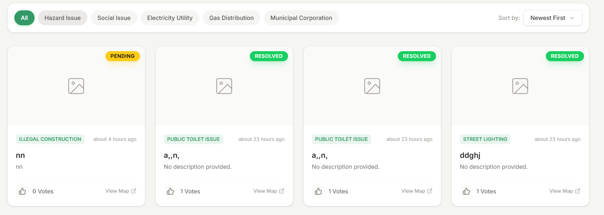
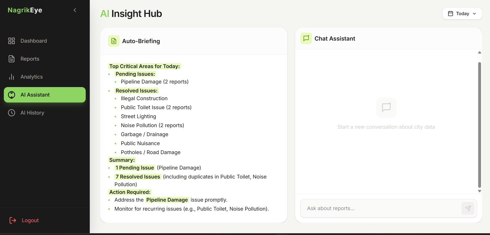
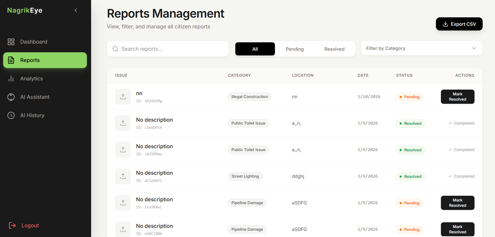
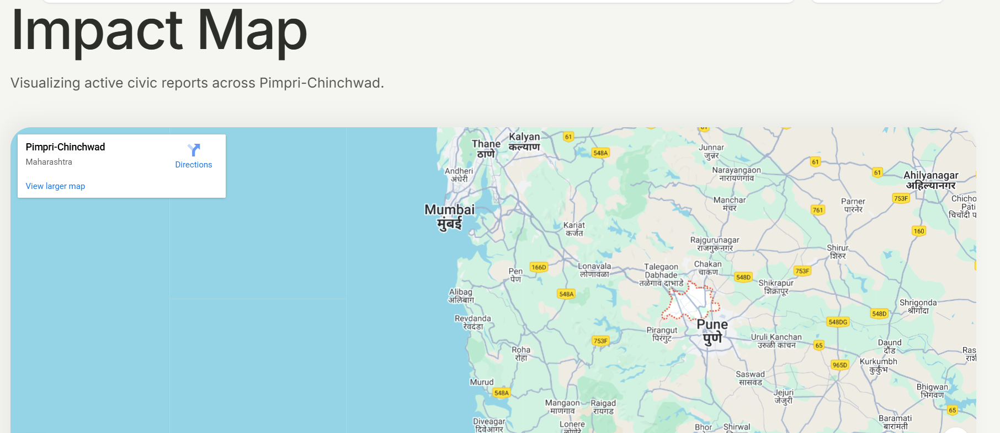

#### Contents : 

- [Project Idea:](#project-idea)
- [Core Features](#core-features)
- [Business Model](#business-model)
  - [Potential Users / Adopters](#potential-users--adopters)
  - [Tech Stack:](#tech-stack)

### Project Idea: 
In many civic systems, citizen complaints remain unresolved due to lack of transparency, accountability, and fear of retaliation. People hesitate to raise issues because exposing their identity can lead to threats or external pressure. Additionally, citizens are often forced to file RTI applications even for basic public information due to poor accessibility and visibility of government actions. This project aims to reduce such dependency on RTIs by making complaint status and civic data openly available. By ensuring strong user privacy and public transparency, the platform empowers citizens while forcing responsible authorities to take action.

The platform utilizes datasets such as location, population, and issue categories, and leverages an LLM to analyze and generate a prioritized list of civic issues based on their severity and impact. This list is accessible to admin (the municipal corporation) to help them in decision making, and reduce there workload.

---
### Core Features

-   **Upvote-Based Verification**  
    An upvote system is used to establish the authenticity and relevance of reported issues, especially since users remain anonymous. Higher community engagement helps surface genuine and high-impact problems.
    
-   **Metadata Stripping for Privacy**  
    All uploaded images have their metadata (such as device details and location traces) removed to prevent third parties from identifying or tracking the user.
    
-   **AI-Driven Priority List**  
    The platform generates a priority list of issues for municipal corporations by analyzing factors like severity, location, and public engagement. This helps authorities reduce workload and supports data-driven decision-making.
    
    
   -   **Full Public Transparency**  
    All reported issues are marked on a public map and categorized by status such as **Pending** and **Resolved**, ensuring complete visibility into civic problems and government action.
    
---

###  Business Model

The platform follows a **B2G (Business-to-Government)** model, offering the system as a digital governance solution to municipal corporations and government bodies. Revenue is generated by licensing the platform, providing analytics dashboards, AI-powered prioritization tools, and operational insights that help authorities improve response time and resource allocation. By reducing administrative overhead, improving transparency, and minimizing unnecessary RTI filings, the platform delivers measurable value to government stakeholders.

#### Potential Users / Adopters

-   **Municipal Corporations in India**  
    For managing civic complaints related to roads, sanitation, water supply, and public infrastructure.
    
-   **Smart City Mission**  
    To improve transparency, citizen participation, and data-driven urban governance.
    
-   **Urban Local Bodies (ULBs)**  
    For prioritizing issues based on severity, population impact, and public engagement.
    
-   **State Urban Development Departments**  
    For monitoring inter-city performance, issue resolution timelines, and accountability.

---
#### Tech Stack:

 1. React
 2. Firebase
 3. Gemini
